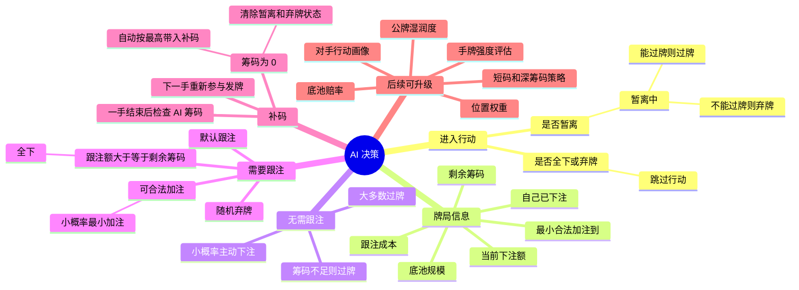

# AI 策略脑图

```mermaid
mindmap
  root((AI 决策))
    进入行动
      是否暂离
        暂离中
          能过牌则过牌
          不能过牌则弃牌
      是否全下或弃牌
        跳过行动
    牌局信息
      当前下注额
      自己已下注
      跟注成本
      剩余筹码
      最小合法加注到
      底池规模
    无需跟注
      小概率主动下注
      大多数过牌
      筹码不足则过牌
    需要跟注
      跟注额大于等于剩余筹码
        全下
      随机弃牌
      可合法加注
        小概率最小加注
      默认跟注
    补码
      一手结束后检查 AI 筹码
      筹码为 0
        自动按最高带入补码
        清除暂离和弃牌状态
      下一手重新参与发牌
    后续可升级
      手牌强度评估
      位置权重
      公牌湿润度
      底池赔率
      对手行动画像
      短码和深筹码策略
```

当前实现仍是轻量测试 AI：主要用于跑通流程、制造下注/跟注/弃牌/全下场景。后续可以把“牌力评估”和“位置权重”接入 `HandEvaluator`，再让 AI 从随机策略升级为可调风格策略。
