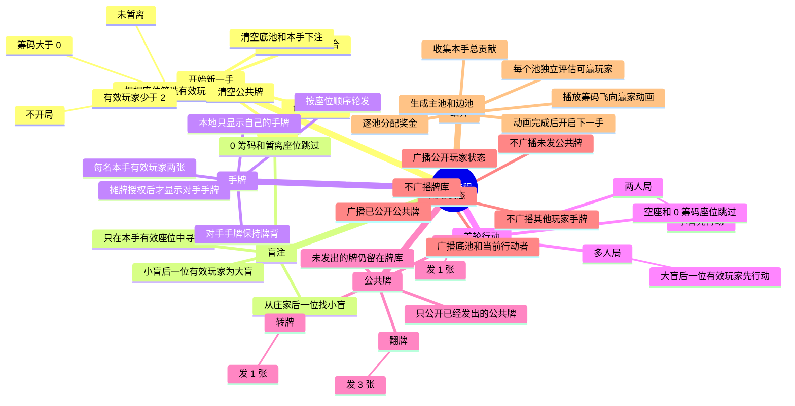

# 发牌算法脑图

```mermaid
mindmap
  root((发牌流程))
    开始新一手
      清空本手玩家集合
      根据座位筛选有效玩家
        未暂离
        筹码大于 0
      有效玩家少于 2
        不开局
      创建新牌库
      洗牌
      清空公共牌
      清空底池和本手下注
    盲注
      从庄家后一位找小盲
      小盲后一位有效玩家为大盲
      只在本手有效座位中寻找
      0 筹码和暂离座位跳过
    手牌
      按座位顺序轮发
      每名本手有效玩家两张
      本地只显示自己的手牌
      对手手牌保持牌背
      摊牌授权后才显示对手手牌
    首轮行动
      两人局
        小盲先行动
      多人局
        大盲后一位有效玩家先行动
      空座和 0 筹码座位跳过
    公共牌
      翻牌
        发 3 张
      转牌
        发 1 张
      河牌
        发 1 张
      只公开已经发出的公共牌
      未发出的牌仍留在牌库
    网络状态
      广播公开玩家状态
      广播已公开公共牌
      广播底池和当前行动者
      不广播牌库
      不广播未发公共牌
      不广播其他玩家手牌
    结算
      收集本手总贡献
      生成主池和边池
      每个池独立评估可赢玩家
      逐池分配奖金
      播放筹码飞向赢家动画
      动画完成后开启下一手
```

这份流程对应当前实现里的 `Deck`、`GameManager.DealHoleCards`、`DealCommunityCards`、`PotManager` 和网络 DTO 隐私规则。
