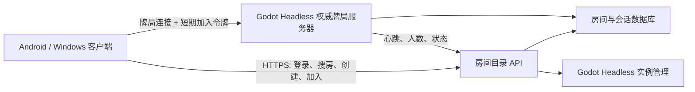

# 公网联机方案清单

## 结论

推荐采用“HTTPS 房间目录 + Godot Headless 权威牌局服务器 + 客户端”的结构。所有客户端只提交操作意图，洗牌、发牌、行动顺序、下注校验、边池和结算全部由服务器执行。

不推荐把玩家手机或电脑继续作为公网 Host，也不推荐用 GitHub 文件充当实时房间列表。GitHub 适合 APK 和热更静态资源，不适合房间心跳、加入令牌和实时状态。

## 方案比较

| 方案 | 改造量 | 稳定性 | 隐藏信息安全 | 适用阶段 |
|---|---:|---:|---:|---|
| 玩家公网直连/端口映射 | 小 | 低 | 低 | 不采用 |
| 自建 Godot Headless 权威服务器 | 中 | 高 | 高 | 推荐基线 |
| Nakama 等托管多人后端 | 大 | 高 | 高 | 用户、好友、匹配需求成熟后评估 |
| 商业游戏服务器编排平台 | 大 | 很高 | 高 | 房间数量明显增长后评估 |

## 推荐架构



## 第一阶段：可供外网双端测试

- [ ] 准备一台具有固定公网 IPv4 的 Linux 云服务器。
- [ ] 准备域名，并为 HTTPS API 配置 TLS 证书。
- [ ] 增加专用服务器导出预设，服务端以 Godot Headless 运行。
- [ ] 将 `GameManager` 的权威逻辑固定在服务端，客户端不得创建牌库或决定结算。
- [ ] 服务端从环境变量读取端口、房间号、人数、盲注、带入和思考时间。
- [ ] 首版每个牌桌启动一个独立进程，分配独立 UDP 端口，避免立即重写为多房间进程。
- [ ] 房间目录 API 实现创建、搜索、加入、心跳、关闭五个操作。
- [ ] 客户端实现 `HttpRoomDirectoryProvider`，接到现有 `IRoomDirectoryProvider`。
- [ ] 创建房间按钮改为请求 API，不再在本机调用 `CreateServer`。
- [ ] 加入房间只使用 API 返回的服务器端点和一次性加入令牌。
- [ ] Windows 与安卓分别使用不同运营商网络完成一整局测试。

## 房间目录最小接口

### 创建房间

`POST /v1/rooms`

请求包含座位数和房间规则。响应返回 `room_code`，不要直接把服务端管理密钥交给客户端。

### 自动搜房

`GET /v1/rooms?protocol_version=N&app_version=X`

只返回可加入、协议兼容、未满员的房间：

```json
{
  "rooms": [
    {
      "room_code": "123456",
      "player_count": 3,
      "max_players": 9,
      "status": "waiting"
    }
  ]
}
```

### 加入房间

`POST /v1/rooms/{room_code}/join`

响应包含短期令牌和牌局端点：

```json
{
  "host": "game.example.com",
  "port": 7001,
  "join_token": "short-lived-token",
  "expires_in": 60
}
```

### 服务端心跳

`POST /v1/internal/rooms/{room_code}/heartbeat`

牌局进程每 10 秒上报人数、状态和协议版本。目录在连续 30 秒未收到心跳后隐藏房间。

### 关闭房间

`DELETE /v1/internal/rooms/{room_code}`

仅允许牌局服务器凭内部凭证调用。

## 第二阶段：断线重连与账号

- [ ] 增加匿名设备账号，后续可升级为正式账号。
- [ ] 玩家身份由服务端签发令牌绑定，不能相信客户端传来的 `playerId`。
- [ ] 断线后保留座位和行动状态一段时间。
- [ ] 使用 `session_id + reconnect_token` 恢复座位。
- [ ] 离线期间按现有超时规则自动过牌或弃牌。
- [ ] 账户余额、补码和房主操作全部在服务端验证并持久化。
- [ ] 对局历史由服务端生成，客户端只渲染有权限看到的字段。

## 第三阶段：安全与反作弊

- [ ] 随机牌库只存在于服务端内存。
- [ ] 服务端仅向本人发送私有手牌，仅在实际翻牌时发送公共牌。
- [ ] 每个操作校验当前座位、行动轮次、最小加注、筹码和请求序号。
- [ ] 重复、过期、越权请求必须拒绝且写入审计日志。
- [ ] API 全部使用 HTTPS；加入令牌短时有效且只能使用一次。
- [ ] 对创建房间、搜索和加入接口做速率限制。
- [ ] 服务端日志不得输出完整牌库或未公开手牌。
- [ ] 后续评估把牌局传输切换到安全 WebSocket，以便统一走 TLS 和常用公网端口。

## 第四阶段：部署与运维

- [ ] 使用 Docker 或 systemd 管理房间目录和 Godot Headless 进程。
- [ ] 配置进程崩溃自动重启、健康检查和日志轮转。
- [ ] 记录在线房间、在线人数、连接失败率、牌局异常退出和平均延迟。
- [ ] 数据库每日备份；令牌密钥放入服务器密钥配置，不进入 Git。
- [ ] 发布新协议时允许旧服务器排空已有牌局，再切换新版本。
- [ ] 热更清单继续由 GitHub 托管，但在线服务版本由 API 返回。

## 当前代码接入点

- `scripts/network/RoomDiscovery.cs`：房间目录提供器接口。
- `NetworkManager.ConfigureRoomDirectoryProvider(...)`：注入公网目录实现。
- `NetworkManager.DiscoverRooms()`：主菜单自动搜房入口。
- `NetworkManager.JoinRoom(...)`：首版仍可接收目录返回的 ENet 公网端点。

## 验收标准

- [ ] 玩家不需要知道 IP、端口或路由器设置，只使用房间列表或房间号。
- [ ] Android 移动网络与 Windows 宽带可互相加入。
- [ ] 创建者退出客户端不会让服务器进程立即丢失整桌状态。
- [ ] 新玩家不能读取未公开手牌、未来公共牌或完整牌库。
- [ ] 掉线重连不会重复入座、重复扣筹码或重置当前牌局。
- [ ] 服务器异常时客户端收到可理解的错误并返回大厅。
- [ ] 不兼容版本不会进入同一房间。

## 官方参考

- Godot 专用服务器导出：https://docs.godotengine.org/en/stable/tutorials/export/exporting_for_dedicated_servers.html
- Godot 高级多人网络：https://docs.godotengine.org/en/stable/tutorials/networking/high_level_multiplayer.html
- Nakama Godot 客户端：https://heroiclabs.com/docs/nakama/client-libraries/godot/
- Nakama 权威多人模式：https://heroiclabs.com/docs/nakama/concepts/multiplayer/authoritative/
